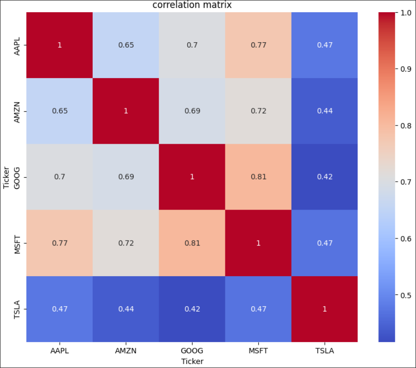

# Portfolio Optimization

This is a beginner project that i made to get comfortable with python libraries commonly used in data analysis.

## Project goal

The goal of this project is to find optimal capital allocation throughout 5 biggest tech companies (Apple, Microsoft, Google, Amazon, Tesla)

## Features
* **Automated data extraction** Fetches historical stock prices from 2018 to 2023 using the yfinance library.
* **Statistical analysis** Computes daily logharitmic returns, annualized covariation matrix and correlation between the assets.
* **Monte carlo simulation** Simulates 10 000 random portfolios to visualize the risk/return.
* **Optimization** Picks one portfolio with highest sharp ratio and one portfolio with lowest risk (volatility).
* **Visualisation** Creates plots to visualise results.

## Libraries
* **Pandas:** Data frames, matrix operations.
* **Numpy:** Numerical operations and matrix operations.
* **Matplotlib and Seaborn:** Data visualisation.
* **yfinance:** Get market data.

## Results

Here are some key results from the notebook.

*scatter plot of sharp ratio for Monte Carlo Simulation of 10 000 portfolios*

*Heatmap of correlation*

Based on the data from 2018-2023 we can observe:
* **safest portfolio** suggests allocation in stable stocks like **GOOG, MSFT, APPL**.
* **optimal portfolio** suggest investment in stocks like **MSFT, AAPL** but also investment in less correlated stock **TSLA**.
